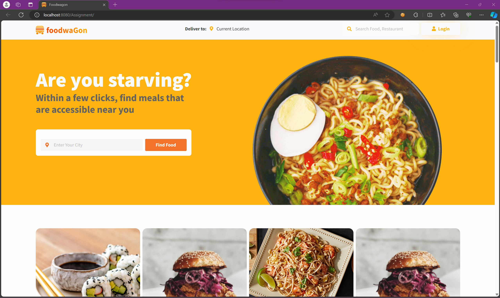
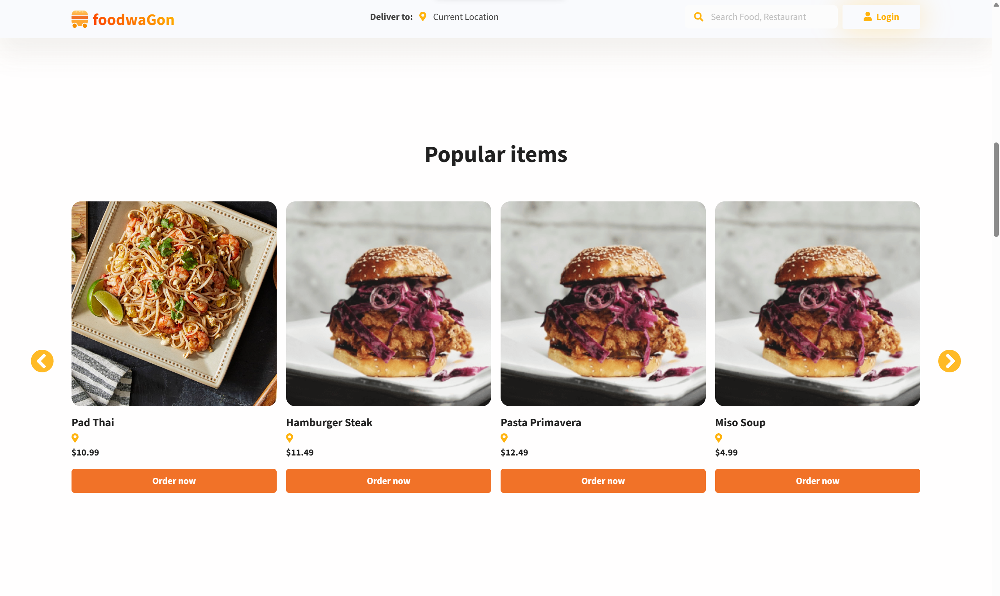

<!-- Improved compatibility of back to top link: See: https://github.com/othneildrew/Best-README-Template/pull/73 -->

# !!! WIP !!!
<!--
*** Thanks for checking out the Best-README-Template. If you have a suggestion
*** that would make this better, please fork the repo and create a pull request
*** or simply open an issue with the tag "enhancement".
*** Don't forget to give the project a star!
*** Thanks again! Now go create something AMAZING! :D
-->

<!-- PROJECT SHIELDS -->
<!--
*** I'm using markdown "reference style" links for readability.
*** Reference links are enclosed in brackets [ ] instead of parentheses ( ).
*** See the bottom of this document for the declaration of the reference variables
*** for contributors-url, forks-url, etc. This is an optional, concise syntax you may use.
*** https://www.markdownguide.org/basic-syntax/#reference-style-links
-->

<!-- PROJECT LOGO -->
 

  <h1 align="center">PRJ301 - Final Project</h1>

  

    Food Ordering website
     
     
  

<!-- TABLE OF CONTENTS -->

  
Table of Contents

  <ol>
    <li><a href="#important-notes">Important Notes</a></li>
    <li><a href="#main-content">Main Content</a></li>
    <ul>
        <li><a href="#home-page">Home Page</a></li>
          <ul>
          <li><a href="#navigation-bar">Navigation Bar</a></li>
          <li><a href="#database-interaction">Database Interaction</a></li>
          </ul>
        <li><a href="#accounts-system">Accounts System</a></li>
          <ul>
          <li><a href="#registering">Registering</a></li>
          <li><a href="#logging-in">Logging In</a></li>
          </ul>
        <li><a href="#ordering-procedure">Ordering Procedure</a></li>
          <ul>
          <li><a href="#browsing">Browsing</a></li>
          <li><a href="#cart-operations">Cart Operations</a></li>
          <li><a href="#orders-history">Orders History</a></li>
          </ul>
        <li><a href="#admin-tools">Admin Tools</a></li>
      <ul>
        <li><a href="#dashboard">Dashboard</a></li>
        <li><a href="#manage-foods">Manage Foods</a></li>
        <li><a href="#manage-accounts">Manage Accounts</a></li>
        <li><a href="#manage-orders-history">Manage Orders History</a></li>
      </ul>
    </ul>
  </ol>

<!-- ABOUT THE PROJECT -->
## Important Notes
- Steps to run project:
  * Download all files this repository (Code > Download ZIP)
  * Run database script "Database_Full.sql" (Database/Database_Full.sql)
  * Run project in NetBeans IDE (Project Folder: (PRJ301)Assignment)
- Unimplemented features which should be ignored:
  * Operations regarding Restaurant table and object
  * Searching functionality
  * Location functionality
  * Order status
  * User's balance top-up
- Front-end was not the main focus (about ~30%)

(<a href="#readme-top">back to top</a>)

## Main Content
<!-- GETTING STARTED -->
### Home Page

#### Navigation Bar

First, the home page, as with every other customer-visible page, contains a navigaton bar on top, with a logo, current customer's location, a search bar, and depending whether or not the customer is logged in, will display:
* A login button if not
* A profile-related function buttons
* Depending on the customer's account's role (1 - admin, 0 - customer), the Admin Tools button: 
  * 1 > is shown
  * 0 > Not shown
 
#### Database Interaction

There are several sections where loading data from database is required for display, for example:

This section displays items gathered whose value in "sold" column in table "Food" surpass a certain value:

This section displays half the items gathered from the table "Food" in the database:

(<a href="#readme-top">back to top</a>)

## Accounts System

### Registering

If the user does not have an account, they can register when they click on the "Login" button. Otherwise, the user can log into the site and use its services.

The new account cannot be duplicates of the following parameters: email and username.

Default values: role = 0 (Customer), balance = 0.

(<a href="#readme-top">back to top</a>)

### Logging in

A "Remember Me" option will save the latest log in information to cookies and retrieve them so that the user won't have to re-enter.

There are pages and functionalities that are restricted if the user is not logged in.

(<a href="#readme-top">back to top</a>)

<!-- USAGE EXAMPLES -->
## Ordering Procedure

### Browsing
### Cart Operations
### Checking Out

Use this space to show useful examples of how a project can be used. Additional screenshots, code examples and demos work well in this space. You may also link to more resources.

_For more examples, please refer to the [Documentation](https://example.com)_

(<a href="#readme-top">back to top</a>)

<!-- ROADMAP -->
### Orders History

- [x] Add Changelog
- [x] Add back to top links
- [ ] Add Additional Templates w/ Examples
- [ ] Add "components" document to easily copy & paste sections of the readme
- [ ] Multi-language Support
    - [ ] Chinese
    - [ ] Spanish

See the [open issues](https://github.com/othneildrew/Best-README-Template/issues) for a full list of proposed features (and known issues).

(<a href="#readme-top">back to top</a>)

<!-- CONTRIBUTING -->
## Admin Tools

Contributions are what make the open source community such an amazing place to learn, inspire, and create. Any contributions you make are **greatly appreciated**.

If you have a suggestion that would make this better, please fork the repo and create a pull request. You can also simply open an issue with the tag "enhancement".
Don't forget to give the project a star! Thanks again!

1. Fork the Project
2. Create your Feature Branch (`git checkout -b feature/AmazingFeature`)
3. Commit your Changes (`git commit -m 'Add some AmazingFeature'`)
4. Push to the Branch (`git push origin feature/AmazingFeature`)
5. Open a Pull Request

(<a href="#readme-top">back to top</a>)

<!-- LICENSE -->
### Dashboard

Distributed under the MIT License. See `LICENSE.txt` for more information.

(<a href="#readme-top">back to top</a>)

<!-- CONTACT -->
### Manage Foods

Your Name - [@your_twitter](https://twitter.com/your_username) - email@example.com

Project Link: [https://github.com/your_username/repo_name](https://github.com/your_username/repo_name)

(<a href="#readme-top">back to top</a>)

<!-- ACKNOWLEDGMENTS -->
### Manage Accounts

Use this space to list resources you find helpful and would like to give credit to. I've included a few of my favorites to kick things off!

* [Choose an Open Source License](https://choosealicense.com)
* [GitHub Emoji Cheat Sheet](https://www.webpagefx.com/tools/emoji-cheat-sheet)
* [Malven's Flexbox Cheatsheet](https://flexbox.malven.co/)
* [Malven's Grid Cheatsheet](https://grid.malven.co/)
* [Img Shields](https://shields.io)
* [GitHub Pages](https://pages.github.com)
* [Font Awesome](https://fontawesome.com)
* [React Icons](https://react-icons.github.io/react-icons/search)

(<a href="#readme-top">back to top</a>)

<!-- ACKNOWLEDGMENTS -->
### Manage Orders History

Use this space to list resources you find helpful and would like to give credit to. I've included a few of my favorites to kick things off!

* [Choose an Open Source License](https://choosealicense.com)
* [GitHub Emoji Cheat Sheet](https://www.webpagefx.com/tools/emoji-cheat-sheet)
* [Malven's Flexbox Cheatsheet](https://flexbox.malven.co/)
* [Malven's Grid Cheatsheet](https://grid.malven.co/)
* [Img Shields](https://shields.io)
* [GitHub Pages](https://pages.github.com)
* [Font Awesome](https://fontawesome.com)
* [React Icons](https://react-icons.github.io/react-icons/search)

(<a href="#readme-top">back to top</a>)

<!-- MARKDOWN LINKS & IMAGES -->
<!-- https://www.markdownguide.org/basic-syntax/#reference-style-links -->
[contributors-shield]: https://img.shields.io/github/contributors/othneildrew/Best-README-Template.svg?style=for-the-badge
[contributors-url]: https://github.com/othneildrew/Best-README-Template/graphs/contributors
[forks-shield]: https://img.shields.io/github/forks/othneildrew/Best-README-Template.svg?style=for-the-badge
[forks-url]: https://github.com/othneildrew/Best-README-Template/network/members
[stars-shield]: https://img.shields.io/github/stars/othneildrew/Best-README-Template.svg?style=for-the-badge
[stars-url]: https://github.com/othneildrew/Best-README-Template/stargazers
[issues-shield]: https://img.shields.io/github/issues/othneildrew/Best-README-Template.svg?style=for-the-badge
[issues-url]: https://github.com/othneildrew/Best-README-Template/issues
[license-shield]: https://img.shields.io/github/license/othneildrew/Best-README-Template.svg?style=for-the-badge
[license-url]: https://github.com/othneildrew/Best-README-Template/blob/master/LICENSE.txt
[linkedin-shield]: https://img.shields.io/badge/-LinkedIn-black.svg?style=for-the-badge&logo=linkedin&colorB=555
[linkedin-url]: https://linkedin.com/in/othneildrew
[product-screenshot]: images/screenshot.png
[Next.js]: https://img.shields.io/badge/next.js-000000?style=for-the-badge&logo=nextdotjs&logoColor=white
[Next-url]: https://nextjs.org/
[React.js]: https://img.shields.io/badge/React-20232A?style=for-the-badge&logo=react&logoColor=61DAFB
[React-url]: https://reactjs.org/
[Vue.js]: https://img.shields.io/badge/Vue.js-35495E?style=for-the-badge&logo=vuedotjs&logoColor=4FC08D
[Vue-url]: https://vuejs.org/
[Angular.io]: https://img.shields.io/badge/Angular-DD0031?style=for-the-badge&logo=angular&logoColor=white
[Angular-url]: https://angular.io/
[Svelte.dev]: https://img.shields.io/badge/Svelte-4A4A55?style=for-the-badge&logo=svelte&logoColor=FF3E00
[Svelte-url]: https://svelte.dev/
[Laravel.com]: https://img.shields.io/badge/Laravel-FF2D20?style=for-the-badge&logo=laravel&logoColor=white
[Laravel-url]: https://laravel.com
[Bootstrap.com]: https://img.shields.io/badge/Bootstrap-563D7C?style=for-the-badge&logo=bootstrap&logoColor=white
[Bootstrap-url]: https://getbootstrap.com
[JQuery.com]: https://img.shields.io/badge/jQuery-0769AD?style=for-the-badge&logo=jquery&logoColor=white
[JQuery-url]: https://jquery.com 
