<!-- Improved compatibility of back to top link: See: https://github.com/othneildrew/Best-README-Template/pull/73 -->

# !!! WIP !!!
<!--
*** Thanks for checking out the Best-README-Template. If you have a suggestion
*** that would make this better, please fork the repo and create a pull request
*** or simply open an issue with the tag "enhancement".
*** Don't forget to give the project a star!
*** Thanks again! Now go create something AMAZING! :D
-->

<!-- PROJECT SHIELDS -->
<!--
*** I'm using markdown "reference style" links for readability.
*** Reference links are enclosed in brackets [ ] instead of parentheses ( ).
*** See the bottom of this document for the declaration of the reference variables
*** for contributors-url, forks-url, etc. This is an optional, concise syntax you may use.
*** https://www.markdownguide.org/basic-syntax/#reference-style-links
-->

<!-- PROJECT LOGO -->
 

  <h1 align="center">PRJ301 - Final Project</h1>

  

    Food Ordering Website
     
     
  

<!-- TABLE OF CONTENTS -->

  
Table of Contents

  <ol>
    <li><a href="#important-notes">Important Notes</a></li>
    <li><a href="#main-content">Main Content</a></li>
    <ul>
        <li><a href="#home-page">Home Page</a></li>
          <ul>
          <li><a href="#navigation-bar">Navigation Bar</a></li>
          <li><a href="#database-interaction">Database Interaction</a></li>
          </ul>
        <li><a href="#account-system">Account System</a></li>
          <ul>
          <li><a href="#registering">Registering</a></li>
          <li><a href="#logging-in">Logging In</a></li>
          </ul>
        <li><a href="#ordering-procedure">Ordering Procedure</a></li>
          <ul>
          <li><a href="#browsing">Browsing</a></li>
          <li><a href="#cart-operations">Cart Operations</a></li>
          <li><a href="#orders-history">Orders History</a></li>
          </ul>
        <li><a href="#admin-tools">Admin Tools</a></li>
      <ul>
        <li><a href="#dashboard">Dashboard</a></li>
        <li><a href="#foods-management">Foods Management</a></li>
        <li><a href="#accounts-management">Accounts Management</a></li>
        <li><a href="#orders-history-management">Orders History Management</a></li>
      </ul>
    </ul>
  </ol>

<!-- ABOUT THE PROJECT -->
## Important Notes
- Steps to run project:
  * Download all files this repository (Code > Download ZIP)
  * Run database script "Database_Full.sql" (Database/Database_Full.sql)
  * Run project in NetBeans IDE (Project Folder: (PRJ301)Assignment)
- Implemented features:
  * Home Page
    * Navigation bar
    * Database interaction
  * Account system
    * Registering
    * Logging in
    * Role division
  * Ordering
    * Browsing catalogue
    * Cart operations (adding, removing, incrementing etc.)
    * Checking out
    * Orders history
  * Admin tools
    * Dashboard
    * Objects management
- Unimplemented features which should be ignored:
  * Operations regarding Restaurant table and object
  * Operations regarding City table and object
  * Searching functionality
  * Location functionality
  * Order status
  * User's balance top-up
  * Forgot password
- Front-end was not the main focus (about ~30%)

(<a href="#readme-top">back to top</a>)

## Main Content
<!-- GETTING STARTED -->
### Home Page

(<a href="#readme-top">back to top</a>)

#### Navigation Bar

First, the home page, as with every other customer-visible page, contains a navigaton bar on top, with a logo, current customer's location, a search bar, and depending whether or not the customer is logged in, will display:
* A login button if not.
* A profile-related function buttons otherwise.
* Depending on the customer's account's role (1 - admin, 0 - customer), the "Admin Tools" button is: 
  * 1 > shown.
  * 0 > hidden.

(<a href="#readme-top">back to top</a>)

 
#### Database Interaction

There are several sections where loading data from database is required for display, for example:

This section displays items gathered whose value in "sold" column in table "Food" surpass a certain value:

This section displays half the items gathered from the table "Food" in the database:

(<a href="#readme-top">back to top</a>)

### Account System

There are pages and functionalities that are restricted if the user is not logged in.

When the user clicks on the "Login" button on the navigation bar or "log in" when they try to add an item to cart, they will be rerdirected to the login page.

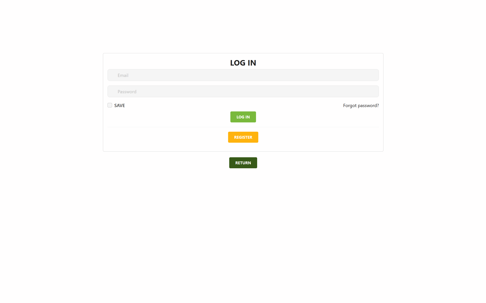

#### Registering

If the user does not have an account, they can register a new one by clicking on the "Register" button. A register window will appear. 

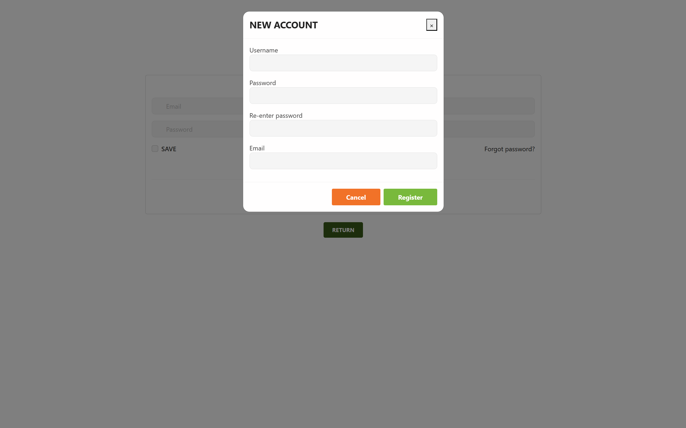

The new account cannot be duplicates of the following parameters: email and username.

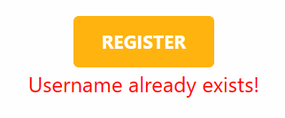

Default values: role = 0 (Customer), balance = 0.

(<a href="#readme-top">back to top</a>)

#### Logging in

The user can log in with their registered account. A "Remember Me" option will save the latest log in information to cookies and retrieve it so that the user won't have to re-enter it.

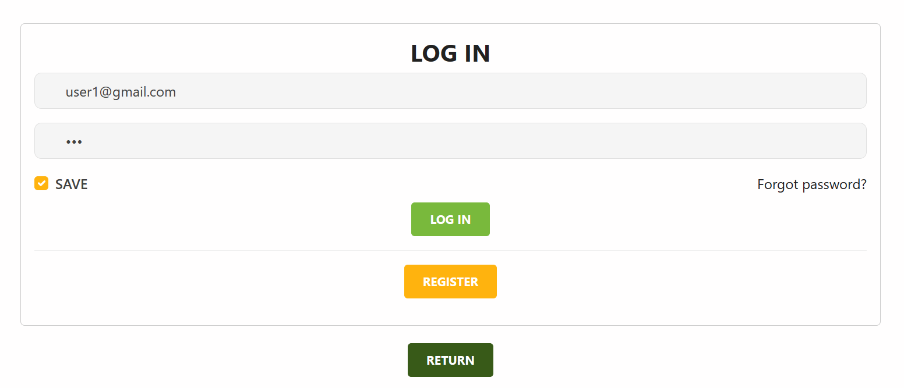

And now the user can use our services.

(<a href="#readme-top">back to top</a>)

<!-- USAGE EXAMPLES -->
### Ordering Procedure

#### Browsing

The user can click on many different elements on the homepage, which will take them to the catalogue page where they can browse through all available items. Click "Expand" to reveal the full list.

When the user click on an item, be it in the home page or the catalogue page, a separate page will show up so that the user can view the item's details and decide the number of that item to add to cart (once again, this activity is prohibited if the user is not logged in).

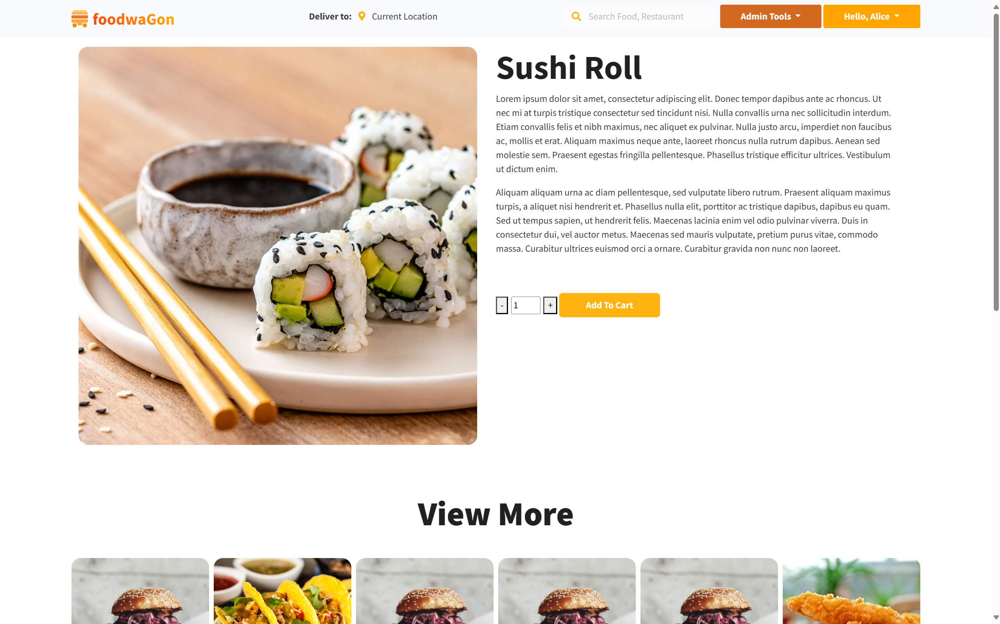

(<a href="#readme-top">back to top</a>)

#### Cart Operations

When the user presses "Add To Cart" button, the corresponding item and its quantity will be added to cart. The user will be notified.

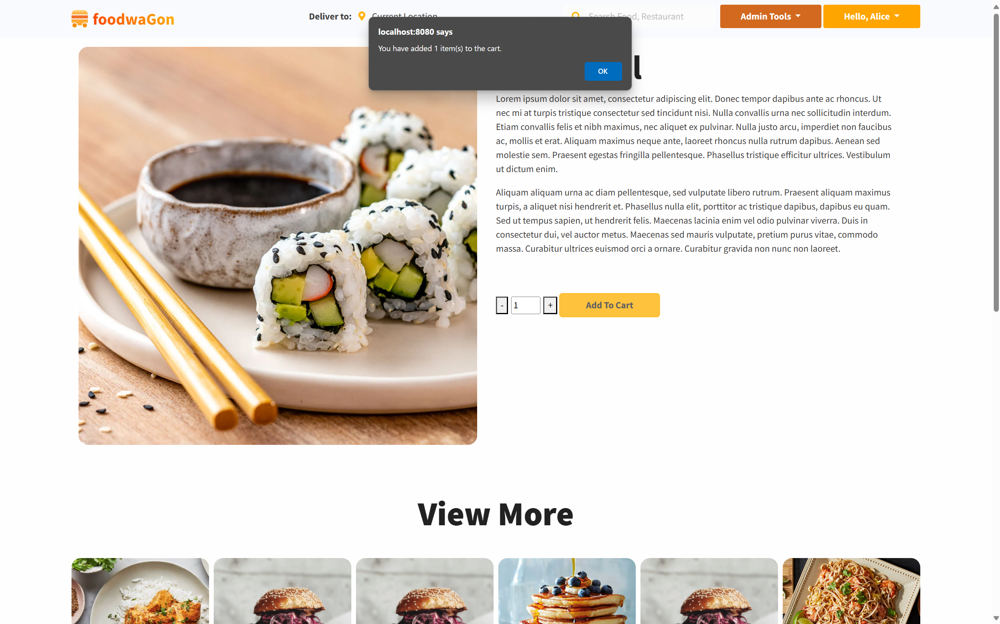

User can then view their cart's details by clicking on "View Cart" under their profile button. 

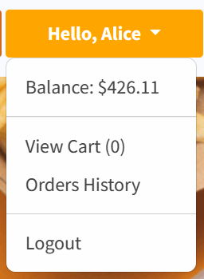

In this page, the details of each item are displayed. The user has the option to proceed to checkout or return to home page.

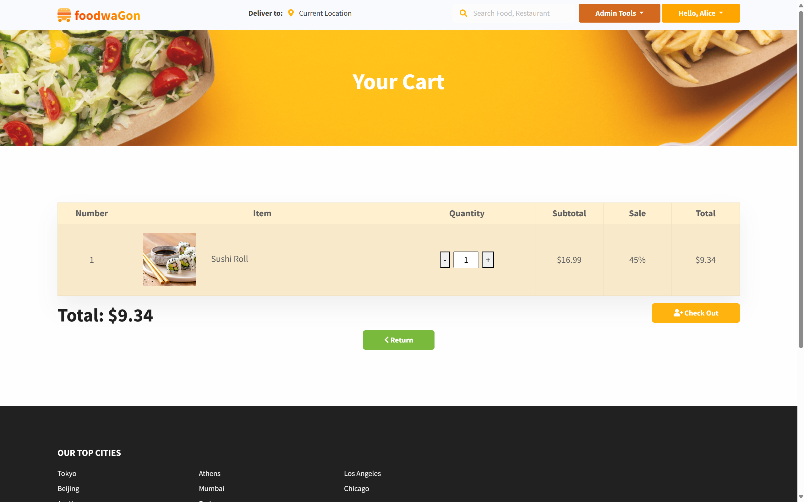

(<a href="#readme-top">back to top</a>)

#### Checking Out

When the user clicks on "Check Out" from the previous page, they will be directed to a page where the total of their cart and their account balance will be shown. The user then enters an address to ship the order to.

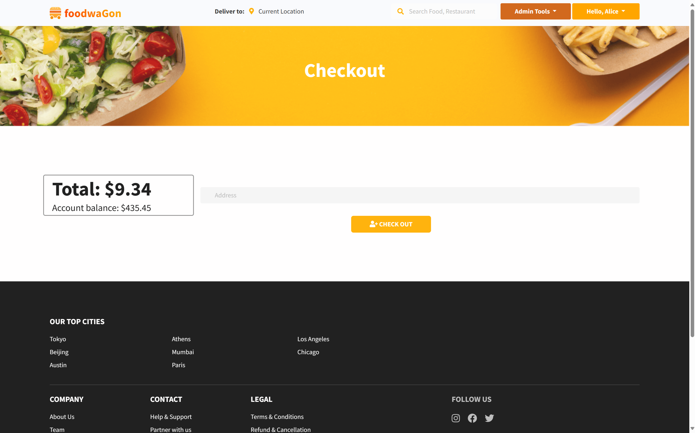

Finally, user clicks "Check Out" to complete their purchase, and their order will be saved in order history. A confirmation page is displayed. "Return home" take the user to the home page, and "continue browsing" takes the user to the catalogue page.

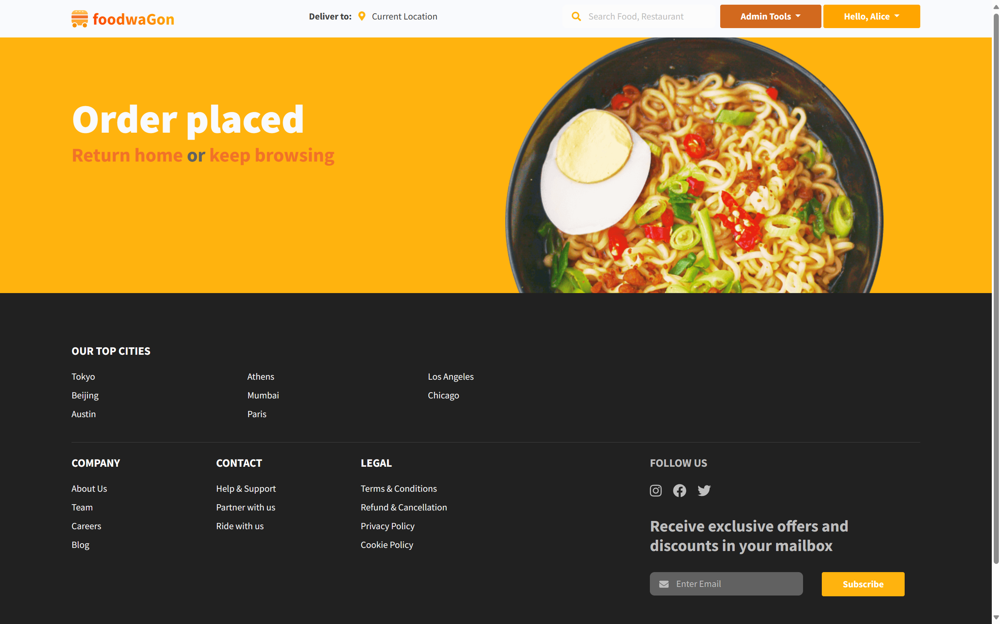

(<a href="#readme-top">back to top</a>)

<!-- ROADMAP -->
#### Orders History

The user can view their past orders by clicking on "Orders History" hidden under their profile button.

All past orders made by the currently logged in user will be shown with general information.

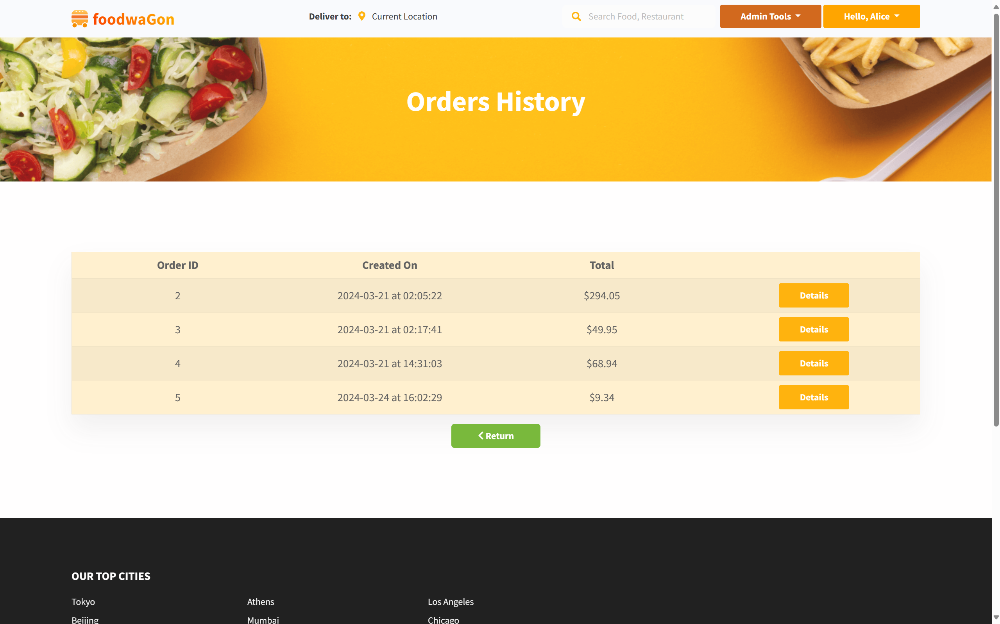

The user can then press on "Details" to view the details of a specific order.

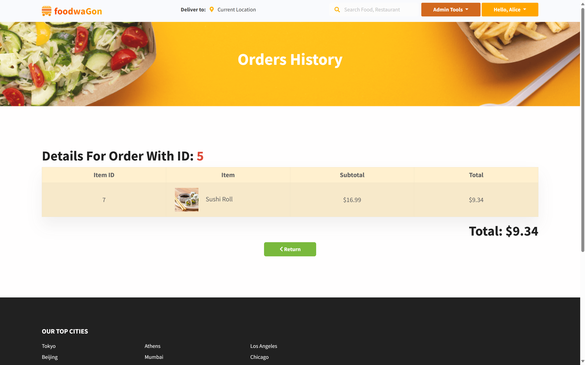

(<a href="#readme-top">back to top</a>)

<!-- CONTRIBUTING -->
### Admin Tools

If the currently logged in user has the role of an Admin (stored as bit value 1 in the database), they can access admin tools by clicking on "Admin Dashboard" hidden under "Admin Tools" button.

(<a href="#readme-top">back to top</a>)

<!-- LICENSE -->
#### Dashboard

The dashboard will display information with regards to the connected database. Proper calculations are used.

The "Details" button will take the user to the "Orders History" tab, which will be explained in details below.

(<a href="#readme-top">back to top</a>)

<!-- CONTACT -->
#### Foods Management

This is where the admin can check on all the available items, add a new one, and update or delete existing ones. All operations should generate a message to let the admin know if the operation succeeded or failed and why.

When the admin clicks on the plus sign next to the table title, a window will open up and the admin can enter new information for a new item.

The "Update" button will take the admin to a different page to give new values to an existing item.

Note: the Restaurant feature is not yet implemented fully so it is advisable to ignore this option.

The "Delete" button will simply remove an item from the list.

(<a href="#readme-top">back to top</a>)

<!-- ACKNOWLEDGMENTS -->
#### Accounts Management

Please refer to the "Foods Management" section as most operations here are similar to those there. 

(<a href="#readme-top">back to top</a>)

<!-- ACKNOWLEDGMENTS -->
#### Orders History Management

This section is similar to that in the user's menu, but you can view all orders by all users instead. Of course, each order is always set when it is placed so there won't be an "Update" button.

Clicking on the "Details" button will take the admin to the page where details of the corresponding order is displayed.

(<a href="#readme-top">back to top</a>)

  <h1 align="center">Thank You For Your Time</h1>

  

    by HE181459 Nguyen Quang Anh
     
     
  

